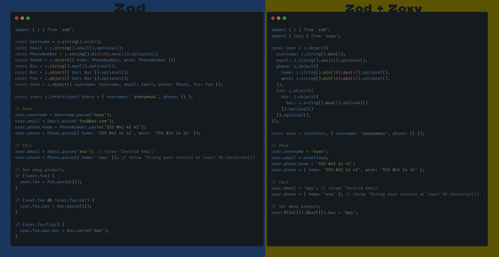

<center>
  <h1>A small type-safe object proxy around <a href="https://github.com/colinhacks/zod">Zod</a> to help you stay safe after your data is loaded.</h1>
  <h2>Because it can be a bit verbose to modify and validate complex structures deeply after loading them.</h2>
  
  <blockquote>If you don't need to modify your data after loading, you probably don't need zoxy!</blockquote>
</center>

<hr />

## Installation

```bash
pnpm add zod zoxy
```

## Basic usage ([live demo])

```ts
import { z } from 'zod';
import { zoxy } from 'zoxy';

const User = z.object({
  username: z.string().min(4),
  email: z.string().email().optional(),
  phone: z.object({
    home: z.string().min(10).max(42).optional(),
    work: z.string().min(10).max(42).optional(),
  }),
  foo: z.object({ bar: z.object({ baz: z.string().max(3).optional() }).optional() }).optional(),
});

const user = zoxy(User, { username: 'anonymous', phone: {} });

// Pass
user.username = 'nyan';
user.email = undefined;
user.phone.home = '555 042 42 42';
user.phone = { home: '555 042 42 42', work: '555 024 24 24' };

// Fail
user.email = 'xxx'; // throw 'Invalid email'
user.phone = { home: 'xxx' }; // throw 'String must contain at least 10 character(s)'
```

## Ensure default value

In the example below the schema has three levels which are all optional and if you want to define the last level it can be quite verbose. Zoxy offers a solution to this with a little helper that makes sure that a default value is set. Simply [prefix](#options) the desired value with a '$' sign and you get a method that allows you to set a default value.

```ts
const Data = z.object({
  foo: z
    .object({
      bar: z
        .object({
          baz: z.string().max(3).optional(),
        })
        .optional(),
    })
    .optional(),
});

const data = zoxy(Data, {});

// Get `data.foo.bar.baz` if defined or set default value where needed.
const baz = data.$foo({}).$bar({}).$baz('baz'); // 'baz'
```

The above line will perform the following actions:

- if `data.foo` is undefined set it to {}
- if `data.foo.bar` is undefined set it to {}
- if `data.foo.bar.baz` is undefined set it to 'baz'
- return `data.foo.bar.baz`

> Note that the returned value can be something different from the default value if it has already been initialized previously.

## Set deep optional property

If you want to assign a new value deeply you must use the following syntax.

```ts
// Set default value on `foo.bar` where needed and set `foo.bar.baz` to 'buzz'.
data.$foo({}).$bar({}).baz = 'buzz';

console.log(data.foo?.bar?.baz); // 'buzz'
```

## Signature

```ts
function zoxy(schema: ZodObject, data: Data, options?: ZoxyOptions): Zoxy;
```

### Options

```ts
type ZoxyOptions = {
  prefix: string; // default '$'
};
```

---

Scaffolded with [@skarab/skaffold](https://www.npmjs.com/package/@skarab/skaffold)

[live demo]: https://www.typescriptlang.org/play?#code/FASwtgDg9gTgLgAgN4IF4IL4IGYymBAclSgBNCBuUSWRFEgDwE9Mc8DipnLhgBjKADsAzogCqwgKYwEAXjQA6KACMAVpL5wAFEmAIEAVykxBAQzCSAXItEwQggOZaAlArD2tAFmcAaPQkkwUxAAG2tUBVt7J1dA4JCXJQg4ECFTBN9-CAALIStFFXVNHX99XItwyLg7R0T3QS0ARgAGVyCGLwAmVyhk1LMMv319AHdYAGtKqNq2jxa20w7PbqSUtMH-DEz9bCgoSsKNbRRlUxgDtSOdBFPUKerousWtAGYevvWXTHe1ga+t1b9dIuPxbKj8ISiQzGORoLhMLQSaQ+ZDQ6RmCpEUyCIRMMBQIyEFE5PLWJBYMG8AD0VIQAAVTMJhMAjNIFKyTOZJLDCIImNieByFHFQrCDIJSJJsPZJKQqEKSYJJApytz5IQAKxahDNZYIPXLQXGBSKtWo1XWTXa3WdfW2w0osYwSZELUanWdTwIT3ezyETDgmkIABi8RZxpFIR5DBjlAQQbg2TwIyIAElBAA3dIgUgBIKhQjhtmm2EoC1EGMMf0YCjx2mJ5NEADKD0cCDARkQAkEcGCggQpkQIUkjMQLQQfGyZ1MmmkWmEzkIQA
